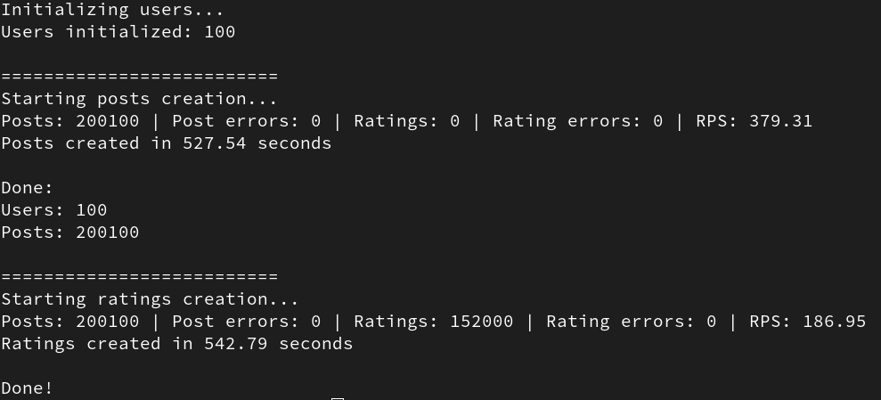

# README

# App42 API

A Rails API app for generating and rating posts using high-throughput concurrent seeds.

## Out of scope
No any auth logic. No frontend UI. No any CI/CD customization.

## Requirements

- Ruby 3.4+
- PostgreSQL
- Rspec

## Setup

1. Install dependencies:
   ```bash
   bundle install
   ```
2. Create, init DB
    ```bash
    bundle exec rails db:create
    bundle exec rails db:migrate
    ```
3. Running Rspec and Rubocop
    ```bash
    make check
    ```

4. Running seeds with Makefile 
    ```bash
    make db_seed
    ```
5. Running seeds manually you need to start rails puma in dev mode before
    ```bash
    bundle exec rails s
    ```
    or in cluster mode (***gives 4-5x performance boost***)

    ```
    WEB_CONCURRENCY=8 RAILS_MAX_THREADS=10 bundle exec puma -C config/puma.rb
    ```
    than open new tab in terminal and run seeds as usual
    ```bash
    bundle exec rails db:seed
    ```
## API reference

#### POST /api/v1/posts 

Creates a new post. If the user does not exist, it will be created.
    
    curl -X POST http://localhost:3000/api/v1/posts \
    -H "Content-Type: application/json" \
    -d '{
        "title": "My first post",
        "body": "Hello from curl",
        "login": "john_doe",
        "ip": "123.123.123.123"
    }'

Success response example, code 201
```json
{
  "data": {
    "post": {
      "id": 1,
      "title": "My first post",
      "body": "Hello from curl",
      "ip": "123.123.123.123",
      "user_id": 1,
      "created_at": "...",
      "updated_at": "..."
    },
    "user": {
      "id": 1,
      "login": "john_doe",
      "created_at": "...",
      "updated_at": "..."
    }
  }
}
```
Response with errors, code 422
```json
{
  "errors": [
    "Login can't be blank","Login is too short (minimum is 4 characters)"
  ]
}
```
Not valid IP, code 422
```json
{   
  "errors": [
    "Ip must be a valid IP address"
  ]
}
```
#### POST /api/v1/posts/post_id/ratings
Allows a user to rate a post once.

```bash
curl -X POST http://localhost:3000/api/v1/posts/1/ratings \
  -H "Content-Type: application/json" \
  -d '{
    "user_id": 1,
    "value": 4
  }'
```
Success response example, code 200
```json
{
  "data": {
    "average_rating":4.0
  }
}
```
Response with errors, code 422
```json
{
  "errors": [
    "Rating must be between 1 and 5"
  ]
}
```

#### GET /api/v1/posts/top

Returns the top-rated posts, sorted by average rating in descending order.

```
curl -X GET "http://localhost:3000/api/v1/posts/top?page=4&limit=7
```

Query Parameters:

 * page (optional, integer): Pagination offset

 * limit (optional, integer): Number of top posts to return. Default is 50, max is 250 records

```json
{
  "data": [
    {
      "id": 946,
      "title": "Labore aut nemo.",
      "body": "Quis sunt sed. Dolorum animi veritatis."
    },
    {
      "id": 1560,
      "title": "Quaerat consequuntur et.",
      "body": "Nisi laboriosam similique. Voluptatem iste vitae."
    },
    {
      "id": 764,
      "title": "Veritatis nesciunt quisquam.",
      "body": "Molestiae voluptatum et. Quaerat facere labore."
    },
    {
      "id": 113,
      "title": "Et laborum quis.",
      "body": "Pariatur perferendis laboriosam. Accusantium maxime ipsa."
    },
  ],
  "page_info": {
    "page": 4,
    "limit": 4,
    "has_next_page": true
  }
}
```
Response with error:

```json
{"errors":["Limit cannot exceed 250"]}
```

#### GET /api/v1/posts/shared_ips
Returns a list of IP addresses that were used by multiple users.
```
curl -X GET "http://localhost:3000/api/v1/posts/top?page=4&limit=7
```

Query Parameters:

 * page (optional, integer): Pagination offset

 * limit (optional, integer): Number of records to return. Default is 50, max is 100 records

```json
{
  "data": [
    {
      "ip": "108.92.74.37",
      "logins": [
        "arnold",
        "candy",
        "clair",
        "delilah"
      ]
    },
    {
      "ip": "11.203.206.75",
      "logins": [
        "carlee",
        "carrol",
        "cathi",
        "debbra",
        "dulce"
      ]
    }
  ],
  "page_info": {
    "page": 2,
    "limit": 2,
    "has_next_page": true
  }
}
```

## Rspec and linter results.
```
make check
Running RuboCop...
Inspecting 34 files
..................................

34 files inspected, no offenses detected
Running RSpec tests...

Randomized with seed 64453

Post
  associations
    belongs to user
    has many ratings and destroys them when post is destroyed
  validations
    is valid with valid attributes
    is invalid if title is too short
    is invalid if body is too short
    is invalid with IPv6 address
    is invalid without a title
    is invalid if body is too long
    is invalid without an ip
    is invalid with IP-like garbage
    is invalid if title is too long

GET /api/v1/posts/top
  returns error when limits greater than 250 posts
  returns top N posts ordered by average rating

POST /api/v1/posts/:post_id/ratings
  rating a post
    returns error if user already rated the post
    creates a rating and returns average
    returns error when rating is invalid
    returns error when user not found
    returns error when post not found

Rating
  validations
    is invalid without value
    is valid with value between 1 and 5
    is invalid if the same user rates the same post twice
    is invalid if value is greater than 5
    is invalid if value is less than 1

GET /api/v1/posts/shared_ips
  returns next_page: false when on last page
  returns shared IPs with multiple authors
  respects pagination with limit and next_page
  returns error if limit exceeds max

User
  is valid with a login between 4 and 5 characters
  is invalid if login is too short
  is invalid if login is too long
  is invalid without a login

PaginationConcern
  #pagination_params
    when limit is negative
      defaults to DEFAULT_LIMIT
    when limit exceeds max_limit
      raises PaginationLimitExceeded
    when valid params provided
      returns them as is
    when no params are provided
      returns default page and limit
    when page is invalid
      defaults to page 1
  #paginate_with_next_page
    returns next_page false when no more results
    returns correct slice and next_page true if there is more

POST /api/v1/posts
  returns error for invalid post (missing title)
  creates a new user and post
  uses existing user if login matches
  returns error for invalid user (missing login)

Finished in 0.91493 seconds (files took 0.65318 seconds to load)
42 examples, 0 failures

Randomized with seed 64453
```
## Performance in seeds.rb
After a brief investigation, I decided to use Faraday within Ruby runtime for sending HTTP requests. In my setup (AMD 8 cores x86-64, 16 GB, SSD, Fedora), it consistently outperformed parallel curl via xargs, achieving nearly 2x better performance in terms of request throughput and overall execution time.
- Uses Faraday gem for sending requests in multiple Ruby threads.
- Puma is launched in cluster mode with tuned thread/concurrency settings.
- ```seeds.rb``` optimized to avoid duplicate users and minimize transaction contention.
- Uses Oj for fast JSON parsing.
- DB connection pool parameter was tuned
## seeds.rb results

Script generates at least 200k posts and about 100 users with 70 unique IP addresses. 75% of posts have ratings.
The script uses API controllers and actions for creating records in DB.



There are several ways to further develop the application:

 - Add rate limiting and throttling to protect the API from overload and abuse.

 - Move rating average calculations to a background job for better performance and scalability.

 - Add a bulk insert endpoint to efficiently handle large batches of incoming records.